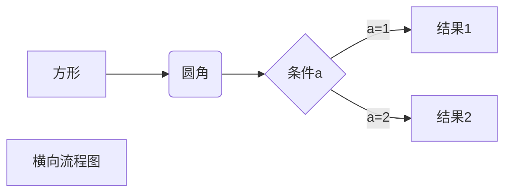
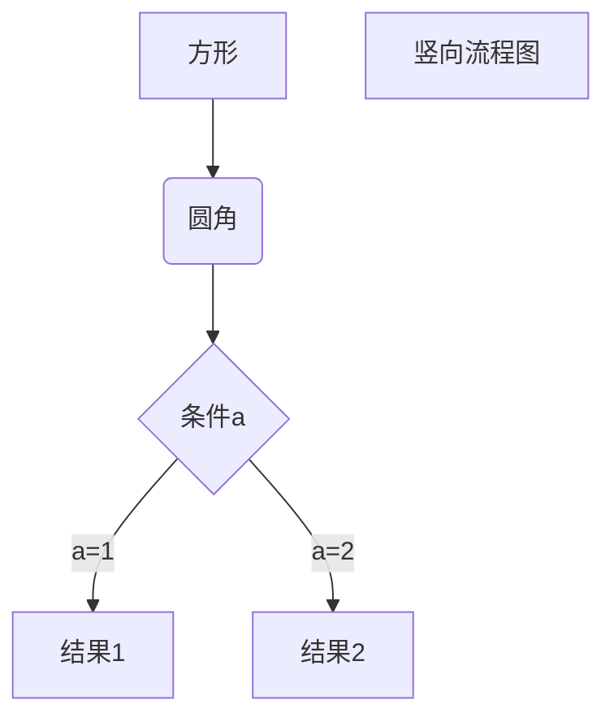
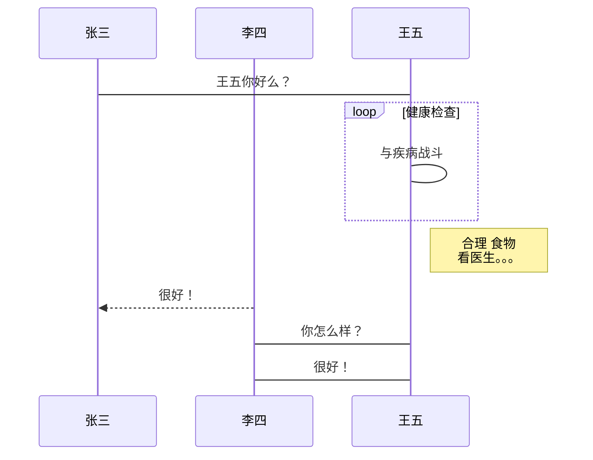
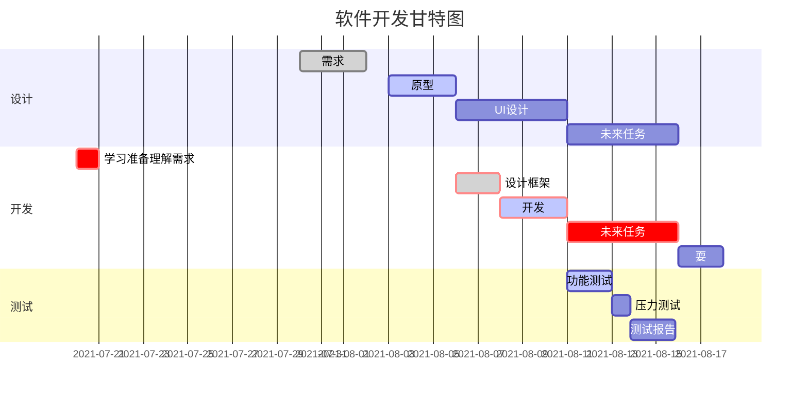

# Markdown使用手册

## 一、Markdown简介
Markdown 是一种轻量级标记语言，它允许人们使用易读易写的纯文本格式编写文档。

Markdown 语言在 2004 由约翰·格鲁伯（英语：John Gruber）创建。

Markdown 编写的文档可以导出 HTML 、Word、图像、PDF、Epub 等多种格式的文档。

Markdown 编写的文档后缀为 .md, .markdown。

## 二、Markdown 标题
### 1、使用 = 和 -标记一级和二级标题
#### = 和 - 标记语法格式如下：

我展示的是一级标题              
\=================

我展示的是二级标题      
\-----------------

### 2、使用#标记
使用 # 号可表示 1-6 级标题，一级标题对应一个 # 号，二级标题对应两个 # 号，以此类推。   
\# 一级标题  
\## 二级标题     
\### 三级标题       
\#### 四级标题                 
\##### 五级标题       
\###### 六级标题

## 三、Markdown段落

#### 段落

Markdown 段落没有特殊的格式，直接编写文字就好，段落的换行是使用两个以上空格加上回车。
![1](data:image/jpeg;base64,/9j/4AAQSkZJRgABAQAAAQABAAD/2wBDAAoHBwgHBgoICAgLCgoLDhgQDg0NDh0VFhEYIx8lJCIfIiEmKzcvJik0KSEiMEExNDk7Pj4+JS5ESUM8SDc9Pjv/2wBDAQoLCw4NDhwQEBw7KCIoOzs7Ozs7Ozs7Ozs7Ozs7Ozs7Ozs7Ozs7Ozs7Ozs7Ozs7Ozs7Ozs7Ozs7Ozs7Ozs7Ozv/wAARCADDAoYDASIAAhEBAxEB/8QAHwAAAQUBAQEBAQEAAAAAAAAAAAECAwQFBgcICQoL/8QAtRAAAgEDAwIEAwUFBAQAAAF9AQIDAAQRBRIhMUEGE1FhByJxFDKBkaEII0KxwRVS0fAkM2JyggkKFhcYGRolJicoKSo0NTY3ODk6Q0RFRkdISUpTVFVWV1hZWmNkZWZnaGlqc3R1dnd4eXqDhIWGh4iJipKTlJWWl5iZmqKjpKWmp6ipqrKztLW2t7i5usLDxMXGx8jJytLT1NXW19jZ2uHi4+Tl5ufo6erx8vP09fb3+Pn6/8QAHwEAAwEBAQEBAQEBAQAAAAAAAAECAwQFBgcICQoL/8QAtREAAgECBAQDBAcFBAQAAQJ3AAECAxEEBSExBhJBUQdhcRMiMoEIFEKRobHBCSMzUvAVYnLRChYkNOEl8RcYGRomJygpKjU2Nzg5OkNERUZHSElKU1RVVldYWVpjZGVmZ2hpanN0dXZ3eHl6goOEhYaHiImKkpOUlZaXmJmaoqOkpaanqKmqsrO0tba3uLm6wsPExcbHyMnK0tPU1dbX2Nna4uPk5ebn6Onq8vP09fb3+Pn6/9oADAMBAAIRAxEAPwD16e5aFwoiL5Gc7gP51H9uf/n3P/fxf8ajv2xOv+7/AFNVd/vQBe+3P/z7n/v4v+NH25/+fc/9/F/xqjvo30AXvtz/APPuf+/i/wCNH25/+fc/9/F/xqjvo3+9AF77c/8Az7n/AL+L/jR9uf8A59z/AN/F/wAao76N9AF77c//AD7n/v4v+NH25/8An3P/AH8X/GqO+jf70AXvtz/8+5/7+L/jR9uf/n3P/fxf8ao76N9AF77c/wDz7n/v4v8AjR9uf/n3P/fxf8ao76N/vQBe+3P/AM+5/wC/i/40fbn/AOfc/wDfxf8AGqO+jfQBe+3P/wA+5/7+L/jR9uf/AJ9z/wB/F/xqjvo3+9AF77c//Puf+/i/40fbn/59z/38X/GqO+jfQBe+3P8A8+5/7+L/AI0fbn/59z/38X/GqO+jf70AXvtz/wDPuf8Av4v+NH25/wDn3P8A38X/ABqjvo30AXvtz/8APuf+/i/40fbn/wCfc/8Afxf8ao76N/vQBe+3P/z7n/v4v+NH25/+fc/9/F/xqjvo30AXvtz/APPuf+/i/wCNH25/+fc/9/F/xqjvo3+9AF77c/8Az7n/AL+L/jR9uf8A59z/AN/F/wAao76N9AF77c//AD7n/v4v+NH25/8An3P/AH8X/GqO+jf70AXvtz/8+5/7+L/jR9uf/n3P/fxf8ao76N9AF77c/wDz7n/v4v8AjR9uf/n3P/fxf8ao76N/vQBe+3P/AM+5/wC/i/40fbn/AOfc/wDfxf8AGqO+jfQBe+3P/wA+5/7+L/jR9uf/AJ9z/wB/F/xqjupGbcUXJwzqpwexYCgC/wDbm/59z/38X/Gj7c//AD7n/v4v+NUBE7J50SSqRkFGWQ7un94AjqeelCSh0DDIz2PagC/9uf8A59z/AN/F/wAaPtz/APPuf+/i/wCNc1/wkYV5HksZ1tY7gwNcblKhg23JGc4z7Vch1NJobuQIwFrI6MPUqM8UAbP25/8An3P/AH8X/Gj7c/8Az7n/AL+L/jXO2viK1ub+Gyw8cs9ss8e7owYZ2/Xih9fjEKtHbyyzSXDwRQoRudkJBOc4A4zk0AdF9uf/AJ9z/wB/F/xo+3P/AM+5/wC/i/41zya/CsV0byGS0ktFDyRvgkqehUjg5xj60W+tu1zDBd2E9n9pz5LSMpDHGdpwflOOxoA6H7c//Puf+/i/40fbn/59z/38X/GuatvEQmaBpLGeKC5kMUUxZSpbJHIByOh7VpXF7bWihrm4ihByQZHC/wA/qKANP7c//Puf+/i/40fbn/59z/38X/GsuO/tZpTFFcwySBQ2xZATg9Dj0qv/AGzavfQWkEsc7SlgxjkB8sqM8gUAbn25/wDn3P8A38X/ABo+3P8A8+5/7+L/AI1R3+9G+gC99uf/AJ9z/wB/F/xo+3P/AM+5/wC/i/41mzzNGoKbSSwHzkgc/QGonubmLaZI4trOF+VyTycelAGv9uf/AJ9z/wB/F/xo+3N/z7n/AL+L/jWNPqSQzOnDBFHHck/0x/OmxanuYqwRjhm/duDwKANv7c//AD7n/v4v+NH25/8An3P/AH8X/GsH+1WEKOY1Usf4mGP0OfT86tWt19ogEhxnJHynNAGp9uf/AJ9z/wB/F/xo+3P/AM+5/wC/i/41R30b6AL325/+fc/9/F/xo+3P/wA+5/7+L/jVHfRv96AL325/+fc/9/F/xo+3P/z7n/v4v+NUd9G+gC99uf8A59z/AN/F/wAaPtz7gPs5wTyfMXj9ao76XfQBf+2f9Mj/AN9r/jR9s/6ZH/vpf8az99G6gDQ+2/8ATI/99r/jSfbTuAEJxjrvX/GqG6jdQBofbP8Apkf++1/xo+2f9Mj/AN9L/jWfvo3UAaH23/pkf++1/wAaPtv/AEyP/fa/41n7qN/vQBofbP8Apkf++1/xo+2f9Mj/AN9r/jWfvo30AbCtuQNjGRnFFNh/1Ef+6P5UUAZ+pti5X/cH8zVPfWjfafJdzCRJ1jAXGDHu9fcVX/sWf/n7j/78n/4qgCtvo31Z/saf/n7j/wC/J/8AiqP7Gn/5/I/+/J/+KoArb6N9Wf7Fn/5/I/8Avyf/AIqj+xZ/+fuP/vyf/iqAK2+jfVn+xp/+fuP/AL8n/wCKo/saf/n8j/78n/4qgCtvo31Z/sWf/n8j/wC/J/8AiqP7Fn/5+4/+/J/+KoArb6N9Wf7Gn/5+4/8Avyf/AIqj+xp/+fyP/vyf/iqAK2+jfVn+xZ/+fyP/AL8n/wCKo/sWf/n7j/78n/4qgCtvo31Z/saf/n7j/wC/J/8AiqP7Gn/5/I/+/J/+KoArb6N9Wf7Fn/5/I/8Avyf/AIqj+xZ/+fuP/vyf/iqAK2+jfVn+xp/+fuP/AL8n/wCKo/saf/n8j/78n/4qgCtvo31Z/sWf/n8j/wC/J/8AiqP7Fn/5+4/+/J/+KoArb6N9Wf7Gn/5+4/8Avyf/AIqj+xp/+fyP/vyf/iqAK2+jfVn+xZ/+fyP/AL8n/wCKo/sWf/n7j/78n/4qgCtvo31Z/saf/n7j/wC/J/8AiqP7Gn/5/I/+/J/+KoArb6N9Wf7Fn/5/I/8Avyf/AIqj+xZ/+fuP/vyf/iqAK2+jfVn+xp/+fuP/AL8n/wCKo/saf/n8j/78n/4qgCtvo31Z/sWf/n8j/wC/J/8AiqP7Fn/5+4/+/J/+KoArb6N9Wf7Gn/5+4/8Avyf/AIqj+xp/+fyP/vyf/iqAK2+jfVn+xZ/+fyP/AL8n/wCKo/sWf/n7j/78n/4qgCtvo31Z/saf/n7j/wC/J/8AiqP7Gn/5/I/+/J/+KoArb6A2ZYf+uqf+hCrP9jT/APP3H/35P/xVI2iSsCrXUZB6gwH/AOKoAgt4niuxK1lHtLZA8s/Jz1GIQcj3NIzYlm/66v8A+hGpP+EcX/npbf8AgN/9lUi6JKqgLdRgDoBAf/iqbYa9TkH0W7CvcYmkI1FpjaGf5JIy5IOM4yOG59OasSDU7M6jawaebhLuRnilWRVVdwAIYE54I7V1H9jT/wDP4n/fk/8AxVH9jT/8/kf/AH5P/wAVSA5VNCkdpYpDs2WtulvcKRlZY9/zAe2R9QaitLHVbWGzvZLdXuYLidpoEcDesjEkqSceh5rr/wCxp/8An8j/AO/J/wDiqP7Gn/5+4/8Avyf/AIqgDlLrT7/Vxe3Lwizd4Eit45GDHKtvy23IGTgd6sO2oapd2Qm09rOK2l86R5JFbLAEBV2k8ZPU46V0f9jT/wDP5H/35P8A8VR/Y0//AD+R/wDfk/8AxVAHE2ek3sbWm3T5YbiC43tcS3IaPbuOcJuPJU46D61rzQTX2p2NxPZBY7dpgwZlbGcBW/H9K3/7Gn/5/I/+/J/+Ko/saf8A5/I/+/J/+KoA5O00e4gt9ORIFgeITiV1K5TeDg8decU3TbG8S/0tn0pLVbKF4pZQ6HeSoAIwckZGeeea67+xp/8An8j/AO/J/wDiqP7Gn/5+4/8Avyf/AIqgChLG0jbhcSx8YwhGP5Uz7O//AD+XH5r/AIVpf2NP/wA/cf8A35P/AMVR/Y0//P5H/wB+T/8AFUAZ1788CgoZAHUsAMkjPNQM1ui7orJ/MHKZhI57Vsf2NP8A8/if9+T/APFUf2NP/wA/kf8A35P/AMVQBg3yTPK7Kr5YAZAGBgZ+vb+VJbLcecySBmVlcYcttPUd63/7Gn/5/E/78n/4qj+xp/8An8j/AO/J/wDiqAOeEE44WI8Sk/KTwMEdSw9avacXW0CuhUhm69+a0/7Gn/5/I/8Avyf/AIqj+xp/+fyP/vyf/iqAK2+jfVn+xp/+fuP/AL8n/wCKo/saf/n8j/78n/4qgCtvo31Z/sWf/n8j/wC/J/8AiqP7Fn/5+4/+/J/+KoArb6N9Wf7Gn/5+4/8Avyf/AIqj+xp/+fyP/vyf/iqAK2+jfVn+xZ/+fyP/AL8n/wCKo/sWf/n7j/78n/4qgCtvo31Z/saf/n7j/wC/J/8AiqP7Gn/5/I/+/J/+KoArb6N9Wf7Fn/5/I/8Avyf/AIqj+xZ/+fuP/vyf/iqAK2+jfVn+xp/+fuP/AL8n/wCKo/saf/n8j/78n/4qgCtvo31Z/sWf/n8j/wC/J/8AiqP7Fn/5+4/+/J/+KoArb6N9Wf7Gn/5+4/8Avyf/AIqj+xp/+fyP/vyf/iqANO3/AOPaL/cH8qKWFDHCkZO4qoBIGM4ooAfRRRQAUUUUAFFFFABRRRQAUUUUAFFFFABRRRQAUUUUAFFFFABRRRQAUUUUAFFFFABRRRQAUUUUAFFFFABRRRQAUUUUAFFFFABRRRQAUUUUAFJS0UAJS0UUAFFFFABRRRQAUUUUAFFFFABRRRQAUUUUAFFFFABRRRQAUUUUAFFFFABRRRQAUUUUAFFFFABRRRQAUUUUAFFFFABRRRQAUUUUAFFFFABRRUcjFcYNAD6WoN7etHmN6/pQBPRUHmN60u9vWgCaiod7etG9vWgCaiod7etJ5jev6UAT0VB5jetG9vX9KAJ6Kg8xvWjzG9aAJ6Kg8xs4zR5jetAE9FQeYx70eY3r+lAE9FQeY3rR5jetAE9FQeY2cZo8xvWgCeioPMb1/SjzG9aAJs0ZqHe3rWRbajdyeKLuyaXMEcQZU2jg/L369zQXGDkm10N2lqDe3rS729aCCaiod7etG9vWgCaiod7etG9vWgCaiod7etG9vWgCaiod7etG9vWgCaiod7etG9vWgCaiod7etG9vWgCaiod7etG9vWgCaiod7etG9vWgCaiod7etG9vWgCaiod7etG9vWgCaiod7etG9vWgCaiod7etG9vWgCaiod7etG9vWgCaiod7etG9vWgCaiod7etG9vWgCaiod7etG9vWgCaiod7etG9vWgCaiod7etG9vWgCaiod7etG9vWgCaiod7etG9vWgCaiod7etG9vWgCaiod7etG9vWgCaiod7etG9vWgCaiod7etG9vWgCaiod7etG9vWgCaiod7etG9vWgCaikXlQfaigBajl7VJUcvagCOkpaSgCK3LEOHYsVcgEipaZHCkW7Zu+bk5Yn+dSUAFFFFABXP+MhAdKthcxebB9ug8xPLL7l3jI2gEn6AV0FUtT0/+0Y7dPN8vybmOf7uc7GBx+OOtAHKKlq9r4gn0iB7XTV06SJ4mQxjzwrEkRnlcKR2Gcj0rW1//AJEKf/r0X+QrQfRkfU7i6EmIbyDyrmDbxIRwGzng4JB9Rj0qgPDl9JaRabdauJtNi2Dyxb7ZZFUgqrPuwRwMkKCaAKWqi4tvF1zqtqHdrKygMsK/8tYS8u8Af3hgMP8Adx3ov9SaD/hIdQsZQSbK3aGUcj5g4DfrmuijsPL1i41Dzc+fBHD5e3psZznOe+/9KzrLwra2h1SFpTLZ6goQW5XHkr82VBz0y5I6YoAr6h4Y02y0S4ntYhDfW8LSpe5/fF1GdzP1OSOQeOTTSE8Q6zZ298m61XTku2tz9ySRzj5h3ChTwfWrT6Hqdxa/2fda0JbErsfFvtnkT+6z7scjgkKD9KtX2kPLcwXlhcizuoIzErGPejRnHysuRkZAIwRigChHaw6L4lhtLBBDa31rKz26cIjxlMMF6DIcg464FczpkVkmh6I9vpUunXJMBbUjEEQ8ruDMpydwyADwSRXaWWkzJevf392t1dmLykKReXHEhOSFXJPJAyST0FZ0Phe//sq20i71eOSwgVFKQ2nlvIqkEAsXbHQZwBQBb8Rs839n6cJXiS/uxHKyNtJQKzlQR0ztx+Jqvq9hZeH9Ev8AUNKs4bW6WAqska45JAyfXB5yfSrt5o82oW8kdzfESpc+faTRxhWt8fdHcN3znqCRSppt9dW89rq95b3dvNEYykVsYic9yS7f0oAztQ8MabZaJPPaxeTfW0LSpe5/fF1GdzN1OSOQeOTWdf3Lf29Ya7gobexhlmH/AEzdmV/y3Bv+A1svoep3Fr/Z91rIlsSux8W+2eRP7rPuxyOCQoJ9quS6NDNezSuQYZrMWjQ7eNuT3+hxjFAGFrbG98U6fIDmKwvIoB6GR1LN+ShP++jXW1iWnhr7Np1hatetLJa3QuZJmTmZvm6jPHUDv0rboAhnl2PEFcAlxu57YP8AhWNZEHxpekHIMAII+iVtTWsNwytIuSv6+1YtkAPGl8BwBAP5JTR0Udp+hv0tQ3F1b2kXm3M8cMfTdIwUfmayrjxhoNscNfo59I1L/qBiolOMfidiadCrV+CLfojborA0rxfp+r3rW1vHOu1d3mSKADyBjrnv+lb1EZKSvEVWjOjLlqKzFoooqjIKKKKACiiigAooooAKKKKACiiigAooooAKKKKACiiigAooooAKKKKACiiigAooooAKKKKACiiigAooooAKKKKACiiigAooooAKKKKACiiigAooooAKKKKACiiigAooooAnX7o+lFC/dH0ooAWmOpbGKfRQBD5TeopfKPqKlpCcAnGcelAEflH1FHlH1FEc3mMyFGRlAJDY6HPp9KloAi8o+oo8o+oqWigCLyj6ik8pvUVNVDWdSbTLESxQG4nkkWKCLdt3uxwAT2Hcn0BoAs+W3tR5Z9RVK1TXhco15Pp7wH76QwurLx2YsQecdhVK3v8AWtY8+501rG3tI5XiiNxE8jT7SVLcMu0ZBA4J4zQBteWfUUeW3qKxT4kkOiLcrZj7e1z9jFsX+UT7tpG7H3eC2cdKWW/1nSZLeXU3sri0nlWGRreJ42hZjhTyzbhuIHbrQBs+U3qKPKb2rKfUNTv9TurPSxbQxWZCS3NwjSbpCA21VBHQEZOe/Sn3l9qOnWNo1z9lkuJryKBzGrBNruFyATkHB9TQBpeWfUUeW3tVHxDf3Om6UZ7PyvPaaGJTKpZRvkVMkAgnhvWprBNUQv8A2jc2kwIGwW9u0ePXO52z+lAFjy29RR5beorLm1DUrzVrnT9LFtEloq+dc3CM43sNwVVBGcKQSc9xTLnUdWins9LhW0k1GdHlklKt5UUakDdtzkk5Axn15oA1/Lb2o8s+orMtL/ULbV49M1X7PIbiNpLe4t0ZA23G5WUk4OCDnPPPpUXhnXbnVzeRXkcUc0EpMflAgNESVU8k85RgfpQBseW3qKPLb1FY3h/XbnWNS1OKSOJbaAobZlB3OhLjc3ODnZkYxwa3qAIvKb1FZdvpNxF4iudQZ4/Klj2qATuz8vt7GtmigqM3G9upla3ocWtaa9pNgHrG/dG9a8g1DT7nS72Szuk2SRn8GHYj2r3SsDxT4Yh8QWgKkRXUX+rkxnI9D7VxYrDKsrrc9jKszeElyT+B/geT2t5cWUwmtZmjcdx0P1Heuu034i3EQCalarMP+ekPDfkeD+lXx8PLe4tcktBKOPlPXFYGo+BdWssmELcKPTg/4VxqjiqGsXdHtSxmWY52qqz7vT8Tv9M8RaVq2Ba3kfmH/lm/yt+R6/hWr5Z9RXhlxbT2km24gkibtuXGfpWrpni/WtLwsV2Zoh/yzn+cfn1H51tDH2dqsbHHXyHmXPhp3Xn/AJnr3lt6ijy29RXI6Z8R7CfCahA9o/8AfHzp+nP6V1lpfWt9CJbW4jmQ/wASMCK74VYVF7rueBXwlfDu1SLQ7y29RR5beoqWitDmIvKPqKXyj6ipKWgCLyj6ijyj6ipaKAIvKPqKPKPqKlooAi8o+oo8o+oqWigCLyj6ijyj6ipaKAIvKPqKPKPqKlooAi8o+oo8o+oqWigCLyj6ijyj6ipaKAIvKPqKPKPqKlooAi8o+oo8o+oqWigCLyj6ijyj6ipaKAIvKPqKPKPqKlooAi8o+oo8o+oqWigCLyj6ijyj6ipaKAIvKPqKPKPqKlooAi8o+oo8o+oqWigCLyj6ijyj6ipaKAIvKPqKPKPqKlooAi8o+oo8o+oqWigCLyj6ijyj6ipaKAIvKPqKPKPqKlooAi8o+oo8o+oqWigBAMACilooAKKKKACmtnaduN2OM9KdSUAQW0cqbjKE3NyWVicn8hgVPRRQAtFFFABWR4itbme2tbm0iM81jdJcCEEAyAZDKCeM7WOM9616SgDlbm6TUta024sYNXinFwv2hZIp4oliCtncDhOpHSptLvH8PWr6XeWN65hlkMElvbPKsyM5YcqDtIzghsdK6SjFAHJ/2VqC6THf/ZSbxdTOom0DDdtOV2ZzjdsP0zVnUrpvEMMOm2lleIrXEUlxLcWzwrEiOHIywGSSoAxnrmujooA5oM2j3eqWt7a3kllfzGeO4tI3cruUKyny8spBGQffrxWcsdxHohkFvqUkEetRTRJLHLJMIVZDna2Xxw1dtRQBzHiG8j1rw7PHDYX7rHcW5kieylRnTzVLYUqC3AOcVZ0240mwtby407Sr6ERoHkT7FKjSYzgKHA3HrwPWt7FFAHOxXEmh6zqEk9ndSWeoOlxHNBA0pRtiqyMqgsPugg4xz7Ut1NLFq1nr0VldS2z2z280YhbzYxuDK2z7xGQQQBnkHFdDiigDBieTWvEFnexW1xDaWMch8y4iaIyu4AACthsAZ5IxyKx2sdVtNMsrmwtphdStcWco2EFEkkYpIR6KcH6Ma7bFGKAMPRrD+z9d1COOB47Zba1ihYqQpChxgHvjityjFFAC0lLRQAlGKWigBMUEA9aWigCpdaXZ3aFJoEYHrkVzOpfDzT7jLWxaBj/cOB+XSuxpKiVOM1aSub0sRVou9OTR5LqHgbVrLJiC3Cj04P8An8axQb7SbgMvn2ko4DDKk/jXuhAPUZqpdaVZXiFZoEYHrkVxzwMG7wdme1Rz6sly1oqSPOtL+Imp2u1L1EvIx/F9x/zHH6V2GmeNdF1Lav2j7PKf+Wc/y/r0/Ws7Uvh5p9xl7VmgY9lPH5dK5XUPBGrWOTGq3CDuvB/z+NT/ALVS/vI1ayvGbfu5fh/l+R60rBhkEEe1LmvF7PWda8PyBIpp4AP+WUoyp/A/0rq9L+JaNtj1S0KnvLByP++T0/M1rDGU27S0fmclfJcRBc1Jqa8v8jvaKo6frWm6qm6yvI5e5UHDD6g8ir2a6001dHjShKDtJWYUtJS0yQooooAKKKKACiiigAooooAKKKKACiiigAooooAKKKKACiiigAooooAKKKKACiiigAooooAKKKKACiiigAooooAKKKKACiiigAooooAKKKKACiiigAooooAKKKKACiiigAooooAKKKKACiiigAooooAKKKKACiiigAooooAKKKKACiiigAooooAKKKKACkpaKAEopaKAEoIB6jNLRQBSu9Jsr1Ck8CMG6gjg1zGo/Duxny9ozQMeynj8q7SkqJ04TVpK5vRxNai705NHkl74N1nTZPMgHm7TkNGdrD/P1qSx8aa/o7rDebp0H8FypDY9m6/nmvViAeCM1Tu9Isb5Ck9ujA9ciuX6ryu9OVj1Fm7qLlxMFNfczC0v4g6RfYS53WUp7ScqT7MP64rp4Z4riMSQyLIjchlbINcdqXw6sptz2jtCx5wDx+Rrn28PeJfD0plsJnIB/wCWTYz9VPBqlUrQ+NXXkS8PgcR/BnyPtLb7z1TNFed2PxEv7JxBrNiWx1dBsf64PB/Sut0vxRo+rYW2u0Ep/wCWT/K35Hr+FawrwnonqclfAYiiryjdd1qjXopMg9KWtjhFopKWgAooooAKKKKACiiigAooooAKKKKACiiigAooooAKKKKACiiigAooooAKKKKACiiigAooooAKKKKACiiigAooooAKKKKACiiigAooooAKKKKACiiigAooooAKKKKACiiigAooooAKKKKACiiigAooooAKKKKACiiigAooooAKKKKACiiigAooooAKKKKACiiigBKKWigBKQqCMEZ+tOooAoXmjWF8hWe3RgfVRXL6j8ObSXL2cjQt1AByPyNdtRUSpwn8SOijia1F3pyaPOUi8YeHDiGb7ZAv8D/MMfjyPoDWpYfEO1LiHVrSWxl7ttLL/iPyrsSoPBAP1qje6JYXyFZ7dGz6jNZ+ylH4H950vF06v8emr91o/wDL8Cez1C0v4vNtLiOZPVGBxVjNcZc+AkhlM+lXc1pKOhjcikj1PxVozbby3j1KEfxL8jgfyqlOS+JfcZvD0p/wp/J6P/I7Siqmm6gmpWcdwiPGWGTG4wy+xqeSeOI4dsH0rW5xtNOxJRmqbajEJVjBXc4JRS2GYDqQO9SG9hwNpJJGcYx/OgLMsUVR/ta3/vx/9/k/xpyajFICYwH29dkinH1weKV0Nwkuhcoqk2pwqqsxQKwypMq4Yeo55FKmqQPkgqQo3NtkViB64Boug5Zb2LmaKprqUJkZSyDaFLDeCyg9CR2BqU3kA/jyemAKYmmieiqbalErFTtBBwQZF/xo/tOE90/7+p/jSuh8kuxcoqE3SBM4O7ONvfNRWuo292MxSxyKSVDxuGXI6jI70xWdrluioGulH3Vd+wwvB/GoodRimLbCsgRijGJt+1h1Bx0NAWe5coqpNqMMKkuRGBjLSnYBngdfWk/tFBKsTKFkbO1C4DNjqQO4pXQcrfQuUtRxzLJwAwOM4YYNSUxBRRRQAUUUUAFFFFABRRRQAUUUUAFFFFABRRRQAUUUUAFFFFABRRRQAUUUUAFFFFABRRRQAUUUUAFFFFABRRRQAUUUUAFFFFABRRRQAUUUUAFFFFABRRRQAUUUUAFFFFABRRRQAUUUUAFFFFABRRRQAUlLRQAlFLRQAmKQqGGCAR706igCNIY4s7EC564FY/iBGNnMQ18u10f/AEE/vG7Y+netusXWor+RGGnzRQTsQpllydsZHJUdzmplsa0f4i1see3moWya1AZLvWwYQyuZXHnIT0C+nv8AhXXaWrHSdTlZ9WIEBGNQPHQ8r/Wq/wDwjdumoWCLby3FqYZxdTOOXY9z6E44qRtO1aDRr2yguVvlki2WiP8ALMitwwOfQVyQhOLbke3Xr0KkYKDta2/r/XyORRY7Swt2khgJdFwWsQ2cjj5iwzXQ+E7dki1O5ItBJMqwpb/KEJOcbgpOMk4qHVfB85tg1pIt1LCyKYkt1Rto44Y/exiruiWesafPcvHZXCx/Zm2RztEu+XPygBePXrWVOEoz95HViK9KrQfs5K7+XX5GHqUQNvFZRWlvbuQxlhlUu1sMnc4fOFT0rR8PxS6dr0dlOlhAXjxDKluc3CEdQ3T0yDTJ/D+qW1hxbvcO9q0brEwLmaTJJf2FXdK0PVtN1yK5fa0KDaPNlBJUqOF9wwxVRjJTvZk1KtJ0HHmXX5szrmXV9M1vUZhqMcskJt45W+zqA4Y8DHbFWba51D7VaXjandMJdWa3aEv8mwE9vwpzaZrFzHIsumyCbUbtLiWTeNsKK3Cn3AH60+30jXFu7aN7JRaxaq1xv3/MFJPJHTGDTtJPS/4k89Nw95xvby7f5mX4gSGTVZEh0yyjVdQWMyMxBkYjcd3oDnk1XgiittVu1uNJ0+RVuI4ni3k+Xu4+X1H9a6QeGEu9Z1G71GGZ4pJisMQxtbcoG8e45qneeFTCbBbGGe7mE++a6JCjG8E7geeAOKmVKd+a3X+uhcMXQ5VS5unn673NXUrbVNQ1CWyjQafYsQslwXy84wPlQduKzNPtriO3/tDQYY41Z2il06STKzbDjcp7NxXXiJNglCgkzZDe2ay/DVjNbWKxXcBR/Omfa45wWyDXU6d5HkQxNqTVlpbTv3v/AFp0MXxDE/2qzuJYJszWoiS3NwY1hcHOXcEdAelU77TrHToIri3MFwvl5uo4b9g+/uy88/Q10mpxyMI4l8OrqkR/ebnkQBGPUAH6CsOx0m6tprp5/B8U6zS741aWP92uPuisZwXN/wAD/gHfh6z9kne1ul1r+PQh8SLcaX4Y0u1bUXdmIYxGMFn53BiSeMcCszUZZNQvPtUV0+sTeQR8kbReQMcHg9c54rrdd06TVdNhuRpxj1BDGphDhjGm/PbjtVDUtEnfxDezf8I/9uhdE8tvNEYU45I9azqU5N+Wnf8Ar8DfC4qmopP4vev8Pden5m34UmtW0u3W0uDcRxL5TO2Q3mdWBBroa5/wnZTWWjWUFzCYpUjcuh6glu/4V0Fd1O/Irnz+J5XWly7XYtFFFWc4UUUUAFFFFABRRRQAUUUUAFFFFABRRRQAUUUUAFFFFABRRRQAUUUUAFFFFABRRRQAUUUUAFFFFABRRRQAUUUUAFFFFABRRRQAUUUUAFFFFABRRRQAUUUUAFFFFABRRRQAUUUUAFFFFABRRRQAUUUUAFFFFABRRRQAlBUHrS0UARG3iZtxQZpzRI4wyg0+igCNoI2UKUBA6cdKb9kg/wCeS/iKmooAhNrAf+Waj6cUC1gAwIkwfapqKAIPscHOY1OfWl+yW/eJT+FTUUARJbxRnKIAaGt4nbcyAmpaKAGlFK7SAR6U2OGOL7igE96kooAia2hc5aJCfUik+yW//PFPyqaigCE2sJGPLUD2GKT7Hb/88l/wqeigBkcSRfcUDNPoooAKKKKACiiigAooooAKKKKACiiigAooooAKKKKACiiigAooooAKKKKACiiigAooooAKKKKACiiigAooooAKKKKACiiigAooooAKKKKACiiigAooooAKKKKACiiigAooooAKKKKACiiigAooooAKKKKACiiigAooooAKKKKACiiigAooooAKKKKACiiigAooooAKKKKACiiigAooooAKKKKACiiigAooooAKKKKACiiigAooooAKKKKACiiigAooooAKKKKACiiigAooooAKKKKACiiigAooooAKKKKACiiigAooooAKKKKACiiigAooooAKKKKACiiigAooooAKKKKACiiigAooooAKKKKACiiigAooooAKKKKACiiigAooooAKKKKACiiigAooooAKKKKACiiigAooooAKKKKACiiigAooooAKKKKACiiigAooooAKKKKACiiigAooooAKKKKACiiigD//2Q==)  
当然也可以在段落后面使用一个空行来表示重新开始一个段落。
![](data:image/jpeg;base64,/9j/4AAQSkZJRgABAQAAAQABAAD/2wBDAAoHBwgHBgoICAgLCgoLDhgQDg0NDh0VFhEYIx8lJCIfIiEmKzcvJik0KSEiMEExNDk7Pj4+JS5ESUM8SDc9Pjv/2wBDAQoLCw4NDhwQEBw7KCIoOzs7Ozs7Ozs7Ozs7Ozs7Ozs7Ozs7Ozs7Ozs7Ozs7Ozs7Ozs7Ozs7Ozs7Ozs7Ozs7Ozv/wAARCAC9AiwDASIAAhEBAxEB/8QAHwAAAQUBAQEBAQEAAAAAAAAAAAECAwQFBgcICQoL/8QAtRAAAgEDAwIEAwUFBAQAAAF9AQIDAAQRBRIhMUEGE1FhByJxFDKBkaEII0KxwRVS0fAkM2JyggkKFhcYGRolJicoKSo0NTY3ODk6Q0RFRkdISUpTVFVWV1hZWmNkZWZnaGlqc3R1dnd4eXqDhIWGh4iJipKTlJWWl5iZmqKjpKWmp6ipqrKztLW2t7i5usLDxMXGx8jJytLT1NXW19jZ2uHi4+Tl5ufo6erx8vP09fb3+Pn6/8QAHwEAAwEBAQEBAQEBAQAAAAAAAAECAwQFBgcICQoL/8QAtREAAgECBAQDBAcFBAQAAQJ3AAECAxEEBSExBhJBUQdhcRMiMoEIFEKRobHBCSMzUvAVYnLRChYkNOEl8RcYGRomJygpKjU2Nzg5OkNERUZHSElKU1RVVldYWVpjZGVmZ2hpanN0dXZ3eHl6goOEhYaHiImKkpOUlZaXmJmaoqOkpaanqKmqsrO0tba3uLm6wsPExcbHyMnK0tPU1dbX2Nna4uPk5ebn6Onq8vP09fb3+Pn6/9oADAMBAAIRAxEAPwD2aiiigAooooAKKKKACiiigAooooAKKKKACiiigAooooAKKKKACiiigAooooAKKKKACiiigAooooAKKKKACiiigAooooAKKKKACiiigAooooAKKKKACiiigAooooAKKKKACiiigAooooAKKKKACiiigAooooAKKKKACiiigAooooAKKKKACiiigAooooAKKKKACiiigAooprEKpJ6D2zQA6imRusiB0OQenGKfQAUUUUAFFFZer6pc2NxY21nZx3M15IyKJZzEq7VLEkhW7D0oA1KK59vEzw2l61zp5iu7GaGOWHzcqRIyhWV8cjDeg6YrS1TUf7Njt38rzPPuYoMbsY3tjPTt6UAXaWsa08Qx3PiK90aSAwvbkCKUtkT/ACKzAccFd68c8HNEviGG3tNQuZoHAs7n7MqRnc0zELtAHHJLAYoA2aKw21vUbJ4X1bSo7a2mkWPzYbrzTEzHA3jaMAnAyCev41Ld6xc/2m2m6ZYrd3EUayTPLN5UcQbO0EgMSxwTgDpQBr0VhN4jaLTdUmubEw3mlwmWW2MoIcbSylXxypwRnHUHilj1u/hvLKDUtMjt0vnMcUsFz5oDbSwDAopGQD60AblFZ2q6r/Z720ENs91d3blIYVYLnAyzEnooHU+4qCXWLvT7Ce61XT0h8sqsSW0/nGZmOAoyq85IH40AbFFYba3qNk8L6tpUdtbTSLH5sN15piZjhd4KjAJwMgnr+NPg18S+J7jRHtjH5UYeOffkSHCllxjggOO/PPpQBs0Vjvr4XxRFoiWxcNEXeffgI2MhcY5OMHr3Fa9AC0UUUAFFFFABRRRQAUUUUAFFFFABRRRQAUUUUAFFFFABRRRQAUUUUAFFFFABRRRQAUUUUAFFFFABRRRQAUUUUAFFFFABRRRQAUUUUAFFFFABRRRQAUUUUAFFFFABRRSEgdSBQAtNYkAkAn2Hel3L6j86Ny+o/OgCG1DrCFeNkIJ6kHv7GpqNy+o/OjcvqPzoAWik3L6j86Ny+o/OgBa57xHBJc6zoUUV1Lau08uJYgpYfuW6bgR+ldBuX1H50m5fUfnQBxMlvNHomtWDrLdarBPHcTOeXuo1dWRgP91NuB0Kmr+o6zp+uzaZZ6Vcpdy/bYppBFz5SISxL/3emMHBya6fcPUfnRlR3HNAHLHTpNQuddNs4jvbbUUmtZD/AAuLeLg/7JBKn2JrPtZptS0a81KK1l32+tJcy223LjYI9647kc/XbXc7h6j86Nw9R+dAHMa3rGn67pn9l6Vdx3lzdyRqFhO4xAOCWf8AugAHr34qUXttoXiTU31OZbWC+8qWGeU7YyVTYybjwCMA4P8Aerosr6jmglTwSKAOM1WRdStfEurW2Ws/7JNtHLghZmUSMzL6gbgM9+aZbT6f/a+kvpGqS6tcGQJLE032hIYyp3OD/ARwM55zjvXbbh6j86Ny+o/OgDmr7UrZdW0vX0kMumiOe2knVSViYsuGPHAzGVJ+lP1m/tdW02O50qePUBp93BcSpbN5hKq2TjHU4yce1dECoGAQKAVAwCMUAcxresafrumf2XpV3HeXN1JGoWE7jEA4JZ/7oAB69+Kr6irQ6lq+qRqTJpl1BcHHUx+UBIP++C34gV1+V9RzRuHqPzoA5HT43OsaLfTKVm1D7VcuD1AZU2KfogUfhXX0m5fUfnRuX1H50AOopNy+o/OjcvqPzoAWik3L6j86Ny+o/OgBaKTcvqPzo3L6j86AFopNy+o/OjcvqPzoAWik3L6j86Ny+o/OgBaKTcvqPzo3L6j86AFopNy+o/OjcvqPzoAWik3L6j86Ny+o/OgBaKTcvqPzo3L6j86AFopNy+o/OjcvqPzoAWik3L6j86Ny+o/OgBaKTcvqPzo3L6j86AFopNy+o/OjcvqPzoAWik3L6j86Ny+o/OgBaKTcvqPzo3L6j86AFopNy+o/OjcvqPzoAWik3L6j86Ny+o/OgBaKTcvqPzo3L6j86AFopNy+o/OjcvqPzoAWik3L6j86Ny+o/OgBaKTcvqPzoyD0IoAWiiigAooooAKil+8PpUtRS/eH0oAZSMwVSzEADqTS0yVgkTMUL4/hAyTQAqOrruRgw9Qc06oLblXYghmbLZUjsOmanoAKKKKACiiigAooooAKKKKACiiigAooooAKKKKACiiigAooooAKKKKACiikoAWiiigAooooAKKKKACiiigAooooAKKKKACiiigAooooAKKKKACiiigAooooAKKKKACiiigAooooAKKKKACiiigAooooAKKKKACnR/fFNp0f3xQBNRRRQAUUUUAFRS/e/CpaSgCCip6KAIKKnooAgoqxRQBXoqxVe9vrXTrZrm8nSGJSAWc9z0HufagAoqvZa1Y6hcGCAziULu2y20kWV9RuUZHIqvL4p0eKWRGumKxsUkmWCRokI6hpAu0fieKANCim3mo2en2n2u6uEjhJAVuu4noABySewFQWOuafqM7W8Esizqu/yp4Xicr/AHgrgEj3FAFmiql14g0yzuXtpJneaMAyJBA8xjz03bAdv41Oup2bm0Cyn/Tc+RlGG/Clj244B64oAkoqLUdVs9Jjie8eRRNJ5cYjheRmbBOAFBPQE/hTrHULfUYmktxMFVtp863eI5+jgE0APpKrXmv6bZXLWsszvMgBeOCF5WQHoWCA7fxoute060jgeWdi1yu6GOOJ3kkHqEUFsc+lAFqiobPV7C/tpbi3n3JDkSgoytGQM4ZSAQcdiKfp2o2mrWMd9YzCa3lztfBGcHB4PI5BoAfRUWnarZatFLLYz+ckMrQuwUjDjGRyBnqORxVygCvQc4OOT2qxRQB5jq3jXxBa3c1m8dvbSRtj5UJP15PP5VizeJdZuXXz9SuduRu8pthx+GK9C8Y+F01u0+0W6gXsI+Q9N4/un+leZQaZfXIk8q3YmJtrL0IPcYrxsRHERqWTbR9rl9XAVKHM4qLWjPUdD8S6fqkKKLtBOf8Almx2t+R6/hW1XhksUkD7Jo3jcdmBBrY0zxdrWlYWO6M0Q/5Zz/MPz6j861p4+2lRWOPEZBzLnw87+v8Amet0Vyul/EfT7jCahC9o5/jHzp+nI/Kustby2vYhLa3EcyH+JGBFehCrCovdZ8/XwlfDu1WLQlFT0VocxBRU9LQBXoqxRQBXoqxRQBXoqxRQBXoqxRQBXoqxRQBXoqxRQBXoqxRQBXoqxRQBXoqxRQBXoqxRQBXoqxRQBXoqxRQBXoqxRQBXoqxRQBXp0f3xU1FABRRRQAUUUUAFFFFABTJCgRvMxsxznpT6SgCtZ4xKF2ld/BT7vQdP89as0UtABRRRQAVhazsPiTQknAMHmTFd3Tzgnyfjjfj6Vu1WvrC11K2NteQLNESDtbsR0IPUEeo5oAy9Q1PUodSOn/ZIQtzBM1tNHMxfKKOq7Rjlh0JqTw2tp/wh+nBNn2c2ab84x935s/jnP41NZ6Bp9jdrdRLcPMilUee6ll2A9QN7HHQflUcvhfSJZXdrZwsrFpIVnkWJyepMYbaffI5oA5/Rwxj8IC4z5Ajn8rfnG7b+6/HZuxW1roH9taAYv+Pj7W/Tr5XlPv8Awzt/HFad5p1nf2gtbq3SSEEFV6bSOhUjkEeoqGx0Sw0+dp4I5GnZdvmzzPK4X0DOSQPYUAZfhxpx4enls4YZNQa8nM6TSFB5nmnO4gEjC4xx0AqGPUX1a78NXssKwu9xcqyK+4ArHIvBwM9PSta68O6bd3T3TRTQzyY8x7e4khMn+9sYZ/Gkk8N6VLZ21qYJEitGZofLuJEZCc5O5WBOcnqe9AFTxSLk3Wh/ZDEJv7Q+Uyglf9TL1wc1rWIvhCf7Qa3aXdwYFYLt49Sec5qnJ4b0yW0jtpEuXSKbzkY3kxdX27ch924cE8ZxzUiaDYJa/Zttw8fmrNiS6lchlII5ZicZA46UAU/Cmw22oMwAuW1G4+0eu4OQv/jmzHtilsgp8a6oZf8AWi1t/Jz18vL7sf8AAuv4Vau/D+m3l2128Mkc8gAkkgnkhMgHTdsYbvxp93oen3qQCaF91uu2KWOV0kQegdSG7DvzQBlXQA8Uan5PQ6SPPx/e3Nsz743fhWTp13Lo+ktp8DbZdRtIJrH2kkVY3x9G2uf94111ppNjY20tvbwbUmyZSWLNISMZZiSSceppP7HsC9i5tlLacpW1JJJjBXae/PHrQBm+EbWKyj1S0hGIoL8xoPYRRgV0FV7ezgtGnaCPYbiUyyfMTuYgDPPTgCp6AFooooASqo062F0bgRKHbrgdatUUAUL3RbC/QpPbowPqAa5bUvhxayZeylaFvTqPyNdxRWc6cJq0kdFHFVqDvTk0ePah4Q1iwJPkeeg7p1/KsqG5vNNuN0Es1rMOuCVP417qyqwwwB+tZ19oGnaghWe2Rv8AgNcU8BG96bsz3KOfzty14qSOE0v4i6jbbY7+FLtP76/I/wDgf0rsdL8YaNqpCR3QhlP/ACym+Vvw7H8KwNR+G8LZexmaI9lPzD9f8a5XUPCmr6eTvtjKo/ij5/TrUqWKo7rmRo6WV4z4HySPZAQRkUteMad4l1nRnEcN0+1eDDMNyj2weR+GK7DS/iTaygJqds0Df89I/mX8uo/Wt6eMpy0ej8zhxGS4mkuaHvLyO4oqrY6lZajEJLO5jmX/AGGzj6+lWq6009jxpRcXaSswopKWmIKKKKACiiigAooooAKKKKACiiigAooooAKKKKACiiigAooooAKKKKACiiigAooooAKKKKACiiigAooooAKKKKACiiigAooooAKKKKACiiigAooooAKKKKACiiigAooooAKKKKACiiigAooooAKKKKACiiigAooooAKKKKACmsiuMMoI9xTqKAMnUPDmm6iuJ7ZCexx0rldR+G68vYTsn+y3zD/Gu/orKdKE/iR1UMZXoP8AdyaPG7jQNd0WbzUilVl6SW7HI/LmtLTPiDq1iRFeot4g4O4bHH4j+or1B40cYdQw9xWTqPhfS9RB862Xd2bHI/Gub6q4a0pWPUWbU665cVTUvNaMraX420XUsIZ/s0p/gn+X9en610CsrAFSCD3Fee6l8N2XL2NwR/sPyP8AP51kRr4p8MviEzCJf4V+dD/wE9P0qvbVYfxI380Q8FhMRrhqln2l/metUVwWl/EuNiI9UtDGehkh5H4qeR+tdhp+safqse+yu4pu5Cn5h9R1FbwrQn8LPPr4KvQ+OOnfp95dpaSlrU5AooooAKKKKACiiigAooooAKKKKACiiigAooooAKKKKACiiigAooooAKKKKACiiigAooooAKKKKACiiigAooooAKKKKACiiigAooooAKKKKACiiigAooooAKKKKACiiigAooooAKKKKACiiigAooooAKKKKACiiigAooooAKKKKAEpjxJIMOgI9xT6KAMTUfCelaiCZLdQx/iAwfzHNcte/D26tZPP0y7dXXlcnkfQjkV6JRWU6MJ7o7KOOxFHSEtO3Q83h8QeK/D7bL+3N5Cvdhk4/wB4f1FdFpfj3RtQ2pNIbOU9puF/766fniuikgjlGHQN9RWJqPg3StRyzQKjn+JeD+YqFTnD4Xf1N3icNW/i07PvH/I3Y5ElQPG4dT0IOQadXBHwnrmiMZNF1KRV6+W5yp/Dp+lWbfxlqenN5eu6U4UdZrcZH4j/AOv+FUqtvjVjJ4RS1ozUvLZ/cdpS1m6br2masoNndxyN/czhh+B5rRrVNPY45QlB2krC0UUUyQooooAKKKKACiiigAooooAKKKKACiiigAooooAKKKKACiiigAooooAKKKKACiiigAooooAKKKKACiiigAooooAKKKKACiiigAooooAKKKKACiiigAooooAKKKKACiiigAooooAKKKKACiiigAooooAKKKKACiiigAooooAKKKKAEqKW2hmGJI1Ye4qWigDDl8Kaf9sS8gjEU8bbldRjn+tbaAqgBOSB1pHdYxlu/QCo/tUWcZO7+7g5/KkklsVKcpfE7k1LUS3ETZ+baR1DcGm/a4P7/wChpkk9FQfa4P75/I05biFhkSL+JxQBLRUBuouSCSo6sFOPzqQSxnpIp/GgB9FQtcxIfmbABxnHH50fa7f/AJ7J+dAE1FMWWNxlXUj60w3MYOOSB1IBIH40ATUU3ehGdwx161H9qi6kso9SpAoAmoqH7VECNxKZ6FgQDT2lRFBJ4PTHOaAH0VB9rt+hlUH0PBpy3MLHCyqT9aAJaKKKACiiigAooooAKKKKACiiigAooooAKKKKACiiigAooooAKKKKACiiigAooooAKKKKACiiigAooooAKKKKACiiigAooooAKKKKACiiigAooooAKKKKACiiigAooooAKKKKACkpaSgDmvF+trpmmSOrYmcGOAdyx6t9AK5bUrzUdJsW05tZLOtsCU8hmfDDJG/sM9K3fHlhBJolxcSR7prbBifPQOwyP0/WsPxb5tnqE0xlmgjurNUUqgZZSBypPUda4K7km36fqfR5bCnKEFa7bd791a3foy34X1S7vLuys5dSSRfL5hktTllA6bz1+tRahqSjxFqcV7rmoWaRSAQpAWI6c/StHQtGktJdOv576a5MUGyOJIMqoYYxuHHHvVayXU7vWtZudLubWOKS58s+ehbeyg9PwzRaajFP+tPUrmo+2qShZK3przenbyMS31fdpMks3iLU1vQG2RKzbSf4ef8A69dJPear/wAI/os9tOiGaMfabqZA4UYGCxP41jadBrB8F3MkVxaLZ7ZdyOh3nrnBrdttNfV/ClpZkqqtawvG8qZRXBOfxxSpKTXyLxcqSmm0rKVu9tPRbfMyVbVL0TavBrRlXT8pmKzO1wfRejdTV/RNQ1K91K3xexX9k8b+aYrcIYyBwD3BzTJ28QaVqFhpUWp2apdbgpS3AVNoz0rV0jSZtHuLq+u5YLiW42qWt4dpQAnLHH4flVwTctL+Zz15U40m5JO693Tpt2XmzHt9YmXVBc6lc3GnRTQulrbLlii4/wBZIP15/pTPtsP/AEPUn/fsU/SrKW08V3v226S9lax8xpXXK8sOg9MVP4ltLdJNKxbRLu1FFJEITcuP1FFp8rbHzUlWUF1S2tba/VGhd3E58ORX2l3cF28SEyzyxFjKq5BwB3zXPG81661PRpYr20zcJI0Hlqyxjjnevr/WtzWksfsOby9n02C3eQJ9lcRrLz93b1J4/nXGDRdQa7sYreSaAXQlNmkr4ZVAzzjpu9qjEOSaS8tmaZfClKDk7LfdeT/4fQ6/w3dalqyzyXX2RrVC0S+TEULsOhVvSshNb1eDVdZnm0sybUjeWBrj5YNoyPrnGeKu+FLWzU7La+vYryIMkljPINqMQckrxkZ9KzV0bUb7VdbSa8je9iRA7E7ImDLgkgei9KblPlj3/wCAEIUPbVU0rWXRrqv6uVbTXrm1vIJxrFwzXEnm3i+QSiLnOBkZ9uK6fW9RvJbGJdL3eXeRtILxhsS3i6k+xwf8K5GK81Hzy+LbyXh/s77S27ygAOufX36Vu63pl+ng+G3nvokFlBukghJIlGQEOfT+tRTnJwla5tiaNL21Nystbf1ZdNF+Y9tUtLi1tfJ8VXNkqRBSsseWkIJ+Yk+v9Ku6LeQvetEvic6lJJGwSBkC89c59eDV+ytreS1tVNtC+2KIYMAbClfXtWf4Ntozb3DpHGr/AG6Vd+wbguOgPauhKSkv+CebOpTlRqWvp6db+VzsY2Dxqw6EZp1NVQqhR0AwKdXUeMFFFFABRRRQAUUUUAFFFFABRRRQAUUUUAFFFFABRRRQAUUUUAFFFFABRRRQAUUUUAFFFFABRRRQAUUUUAFFFFABRRRQAUUUUAFFFFABRRRQAUUUUAFFFFABRRRQAUUUUAFFFFAGZrOlR6raS2s6yGKYKG8sgMMHI61mN4RsZ7xrqe3luGP3UuZtyJ9AK6WiolCMndo2hiKtNcsJNI5y08K2mn3q3NrHcwlST5SXB8tuO4ParthosOnwRw20IjjjdnCs2SzNnOT9DitaimoRWyCderNe9K5zk3hHT5rOKza0dYYSxULcMPvHJz69KnvPDttfWcFpPbAwW3EKRysm0YAwT3rcopckewfWKunvPQ5U+BdJJBNlJkdD9qbirNj4UsdPuftFtbMkoUqGa4ZgMjB4NdDRQqcFqkVLFV5LllJtGINDRbt7pRILh7dbcsWGzA74654qGbwzbXGqrqEwupJFlEqxtPmNWHcCuhopuEX0JjXqRd0+lvkZM2h29xNDNcQRTywFjG8gzt3HJ4789KSXSFl1G0vZfNkntN/lsHAU7vUVr0Ucq7EqrNbP+mZJ0WH7ZFevbxTXUS7VmY4bGMHPqfes4eDrEW88BhuStwytI5uMs23oPp1rp6KThF7oqOIqx2k/+GMo6HbnTvsXkRfZtu37Nj5cfXrn3quPD8Q0g6UFm+yGMpjzAX5bPU/lW7RT5Y9hKtUX2ut/n3MS40QXFn9lZriOIbNphl2uNoxyfcVNo2iw6RbiC3V1jDM5Mj7mZj3JrVoo5Ve9hOtNx5L6BS0lLVGYUUUUAFFFFABRRRQAUUUUAFFFFABRRRQAUUUUAFFFFABRRRQAUUUUAFFFFABRRRQAUUUUAFFFFABRRRQAUUUUAFFFFABRRRQAUUUUAFFFFABRRRQAUUUUAFFFFABRRRQAUUUUAFFFFABRRRQAUUUUAFFFFABRRRQAUUUUAFFFFABRRRQAUUUUAFFFFABRRRQB/9k=)

#### 字体
*斜体文本*

_斜体文本_

**粗体文本**

__粗体文本__

***斜粗体***

___斜粗体___


#### 分割线

***

---

___


#### 删除线
~~删除线~~

#### 下划线

<u>下划线</u>

#### 脚注

脚注是对文本的补充说明。

Markdown 脚注的格式如下:

创建脚注格式类似这样 [^RUNOOB]。

[^RUNOOB]: 菜鸟教程 -- 学的不仅是技术，更是梦想！！！

### 四、Markdown列表

##### Markdown 支持有序列表和无序列表。

无序列表使用星号(*****)、加号(**+**)或是减号(**-**)作为列表标记，这些标记后面要添加一个空格，然后再填写内容：

* 第一项

+ 第二项

- 第三项 

##### 有序列表使用数字并加上 **.** 号来表示，如：

1. 第一项
2. 第二项
3. 第三项

##### 列表嵌套

1. 第一项

   * 元素1
   * 元素2

2. 第二项

   * 元素1
   * 元素2

### 五、 Markdown区块

Markdown 区块引用是在段落开头使用 > 符号 ，然后后面紧跟一个空格符号：

> 区块引用
> 区块引用

另外区块是可以嵌套的，一个 > 符号是最外层，两个 > 符号是第一层嵌套，以此类推：

>  最外层
>  > 第一层嵌套
>  >
>  > > 第二层嵌套


#### 区块中使用列表

> 区块中使用列表
> 1. 第一
> 2. 第二
> * 第一
> * 第二
> * 第三

#### 列表中使用区块

* 第一项
    > 菜鸟
    > 菜鸟教程
* 第二项

### 六、Markdown代码

#### 代码片段
如果是段落上的一个函数或片段的代码可以用反引号把它包起来（`），例如：

`printf()`函数

#### 代码区块

代码区块使用 **4 个空格**或者一个**制表符（Tab 键）**。

实例如下：

```java
public test(String s){
	test();
}
```

```java
public Map<String,Object> addWork(@RequestBody Work work){
        System.out.println("aaa");
        System.out.println(work.getWorkId());
        Map<String, Object> resultMap = new HashMap<>();
        return resultMap;
}
```


### 七、Markdown链接

链接使用方法如下：

[链接名称](链接地址)

或者

<链接地址>

这是一个链接 [菜鸟教程](https://www.runoob.com)

<http://www.baidu.com>

#### 高级链接

我们可以通过变量来设置一个链接，变量赋值在文档末尾进行：

```
这个链接用 1 作为网址变量 [Google][1]
这个链接用 runoob 作为网址变量 [Runoob][runoob]
然后在文档的结尾为变量赋值（网址）

  [1]: http://www.google.com/
  [runoob]: http://www.runoob.com/
```

这个链接用 1 作为网址变量 [Google][1]
这个链接用 runoob 作为网址变量 [Runoob][runoob]
然后在文档的结尾为变量赋值（网址）

[1]: http://www.google.com/
[runoob]: http://www.runoob.com/

### 八、Markdown图片

Markdown 图片语法格式如下：

```


```
* 开头一个感叹号 !
* 接着一个方括号，里面放上图片的替代文字
* 接着一个普通括号，里面放上图片的网址，最后还可以用引号包住并加上选择性的 'title' 属性的文字。


当然，你也可以像网址那样对图片网址使用变量:

```
这个链接用 1 作为网址变量 [RUNOOB][1].
然后在文档的结尾为变量赋值（网址）

[1]: http://static.runoob.com/images/runoob-logo.png
```

这个链接用 1 作为网址变量 [RUNOOB][1].
然后在文档的结尾为变量赋值（网址）

[1]: http://static.runoob.com/images/runoob-logo.png


Markdown 还没有办法指定图片的高度与宽度，如果你需要的话，你可以使用普通的 \ 标签。


### 九、Markdown表格

Markdown 制作表格使用 | 来分隔不同的单元格，使用 - 来分隔表头和其他行。

语法格式如下：

```
|  表头   | 表头  |
|  ----  | ----  |
| 单元格  | 单元格 |
| 单元格  | 单元格 |
```

| 表头 | 表头|
| ----|----|
|单元格|单元格|
|单元格|单元格|

对齐方式

**我们可以设置表格的对齐方式：**

* **-:** 设置内容和标题栏居右对齐。
* **:-** 设置内容和标题栏居左对齐。
* **:-:** 设置内容和标题栏居中对齐。

```
| 左对齐 | 右对齐 | 居中对齐 |
| :-----| ----: | :----: |
| 单元格 | 单元格 | 单元格 |
| 单元格 | 单元格 | 单元格 |
```

| 左对齐 | 右对齐 | 居中对齐 |
| :----- | -----: | :------: |
| 单元格 | 单元格 |  单元格  |
| 单元格 | 单元格 |  单元格  |


### 十、Markdown高级技巧

### 支持的 HTML 元素

不在 Markdown 涵盖范围之内的标签，都可以直接在文档里面用 HTML 撰写。

目前支持的 HTML 元素有：`<kbd> <b> <i> <em> <sup> <sub> <br>`等 ，如：

```
使用 <kbd>Ctrl</kbd>+<kbd>Alt</kbd>+<kbd>Del</kbd> 重启电脑
```

使用 <kbd>Ctrl</kbd>+<kbd>Alt</kbd>+<kbd>Del</kbd> 重启电脑

### 转义

Markdown 使用了很多特殊符号来表示特定的意义，如果需要显示特定的符号则需要使用转义字符，Markdown 使用反斜杠转义特殊字符：

```
**文本加粗** 
\*\* 正常显示星号 \*\*
```

### 公式

当你需要在编辑器中插入数学公式时，可以使用两个美元符 $$ 包裹 TeX 或 LaTeX 格式的数学公式来实现。提交后，问答和文章页会根据需要加载 Mathjax 对数学公式进行渲染。如：

```
$$
\mathbf{V}_1 \times \mathbf{V}_2 =  \begin{vmatrix} 
\mathbf{i} & \mathbf{j} & \mathbf{k} \\
\frac{\partial X}{\partial u} &  \frac{\partial Y}{\partial u} & 0 \\
\frac{\partial X}{\partial v} &  \frac{\partial Y}{\partial v} & 0 \\
\end{vmatrix}
${$tep1}{\style{visibility:hidden}{(x+1)(x+1)}}
$$
```

$$
\mathbf{V}_1 \times \mathbf{V}_2 =  \begin{vmatrix} 
\mathbf{i} & \mathbf{j} & \mathbf{k} \\
\frac{\partial X}{\partial u} &  \frac{\partial Y}{\partial u} & 0 \\
\frac{\partial X}{\partial v} &  \frac{\partial Y}{\partial v} & 0 \\
\end{vmatrix}
${$tep1}{\style{visibility:hidden}{(x+1)(x+1)}}
$$

### typora 画流程图、时序图(顺序图)、甘特图

#### 1、横向流程图源码格式：




#### 2、竖向流程图源码格式：



#### 3、标准流程图源码格式：

##### 竖向

```flow
st=>start: 开始框
op=>operation: 处理框
cond=>condition: 判断框（是否？）
sub1=>subroutine: 子流程
io=>inputoutput: 输入输出框
e=>end: 结束框
st->op->cond
cond(yes)->io->e
cond(no)->sub1(right)->op
```


##### 横向

``` flow
st=>start: 开始框
op=>operation: 处理框
cond=>condition: 判断框（是否？）
sub1=>subroutine: 子流程
io=>inputoutput: 输入输出框
e=>end: 结束框
st(right)->op(right)->cond
cond(yes)->io(bottom)->e
cond(no)->sub1(right)->op
```


**5、UML时序图源码样例：**

``` sequence
对象A->对象B:对象B你好么（请求）
Note right of 对象B:对象B的描述
Note left of 对象A:对象A的描述(提示)
对象B-->对象A:我很好（响应）
对象A-对象B:你真的好么？
```

#### 6、UML时序图源码复杂样例：

``` sequence
Title:标题:复杂使用
对象A->对象B:对象B你好么（请求）
Note right of 对象B: 对象B的描述
Note left of 对象A: 对象A的描述(提示)
对象B-->对象A: 我很好(响应)
对象B->小三:你好吗
小三-->对象A:对象B找我了
对象A->对象B: 你真的好吗？
Note over 小三,对象B:我们是朋友
participant C
Note right of C:没人陪我玩


```

**7、UML标准时序图样例：**




**8、甘特图样例：**




